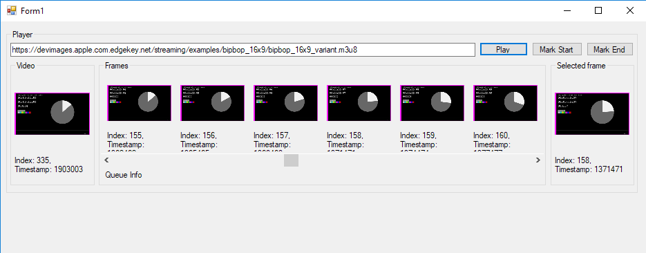

# FFmpegCapturePlayer

A WIP FFmpeg based video only player which can be used to mark frames in a video and do further processing. Currently it can be used to collect key frames at a given threshold, can do some filtering.

Video is displayed in the left panel, list of frames in the middle. and right most box shows the selected frame.

Video Player is a separate control and it can be easily used to play multiple videos simulteneously.

## Requirements

- Download ffmpeg `Dev` and `Shared` package from https://ffmpeg.zeranoe.com/builds/. It is tested to work with ffmpeg-20180816-f631c32.
  - Extract the Dev package and place the contents (include, lib etc) in `ffmpeg` folder in the solution directory.
- Place all ffmpeg dlls from Shared package in your PATH or in the same directory as FFmpegPlayer.exe
 

